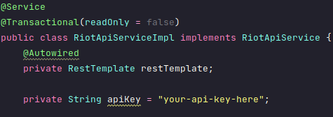
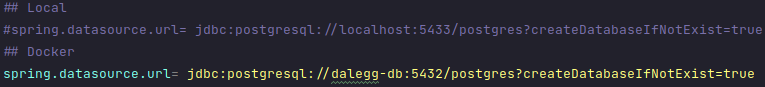
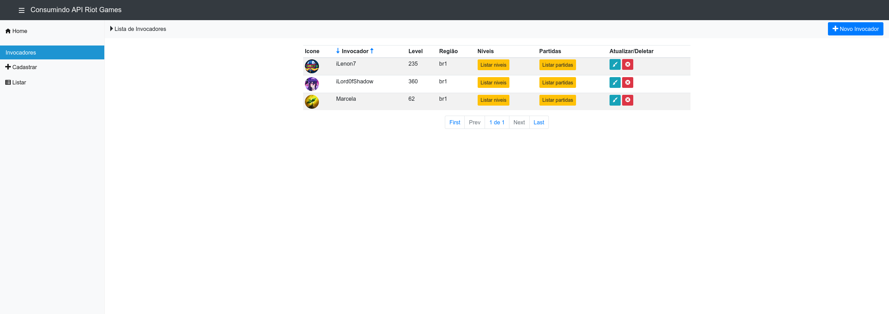

# Dale.gg 🎮

> MVC project with Spring using Riot API

[](https://github.com/jlenon7?tab=followers)
[](https://github.com/secjs/base/stargazers/)

<p>
  

  

  
</p>

The intention behind this repository is to test `Spring MVC` projects consuming Riot API.


## IMPORTANT

> You need to create an account in Riot developer portal to get an API Key and set it inside of RiotApiServiceImpl

[Click here to create you account in Riot API!](https://developer.riotgames.com/)

<p align="center">
    
</p>

## Running project local

> First run an instance of PostgreSQL, you can use this command to run with docker.

```bash
docker run --name postgresql -e POSTGRES_PASSWORD=root -p 5433:5432 -d postgres
```

> Then build the project using Maven

```bash
mvn clean package
```

> Then run the .jar file created by Maven

```bash
java -jar target/dale-gg-1.0.0-SNAPSHOT.jar
```

---

## Running project with docker-compose

> First change the url of the database inside application.properties to dalegg-db instead of localhost

<p align="center">
    
</p>

> Then run the project using docker-compose

```bash
docker-compose up -d --build
```

---

## Project home example

<p align="center">
    
</p>

---

Made with 🖤 by [jlenon7](https://github.com/jlenon7) :wave:
